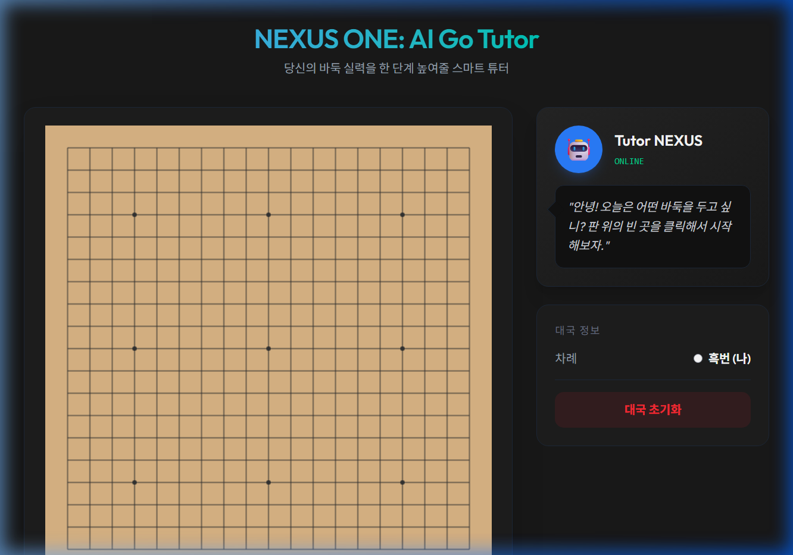
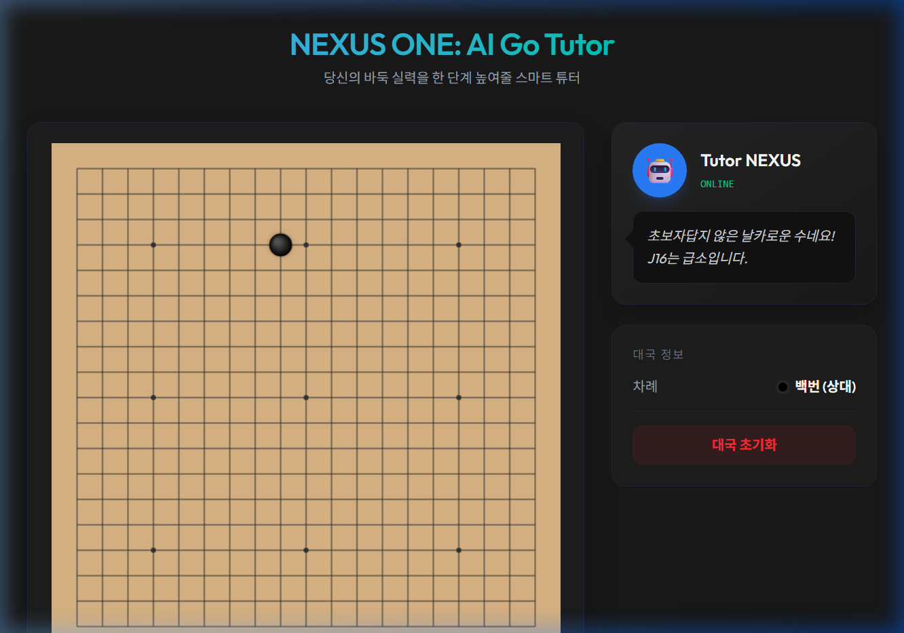

# NEXUS ONE: AI Go Tutor - Project Documentation

## 1. 프로젝트 개요

**NEXUS ONE**은 서버 유지비 0원을 목표로 하는 100% 클라이언트 사이드 기반의 바둑 교육용 웹 애플리케이션입니다. 브라우저에서 로컬로 구동되는 AI 엔진을 통해 사용자에게 친근한 훈수와 최적의 수를 제안합니다.

---

## 2. 기술 스택 (Tech Stack)

- **Framework**: [Vite 6.0](https://vitejs.dev/)
- **Styling**: [Tailwind CSS v4.0](https://tailwindcss.com/) (Native Vite Plugin)
- **Logic**: Vanilla JavaScript (ES Module)
- **Graphics**: HTML5 Canvas API
- **Deployment Strategy**: GitHub Pages (Static Hosting)

---

## 3. 주요 구현 기능

### 3.1. 바둑판 렌더링 및 인터랙션

- **19x19 규격**: 표준 바둑판 및 화점(Hoshi) 포인트 렌더링.
- **Canvas 기반 최적화**: 입체적인 돌 렌더링(Radial Gradient) 및 부드러운 배치.
- **착수 로직**: 중복 착수 방지 및 좌표(A1~T19) 계산 시스템.

### 3.2. Tutor NEXUS UI

- **AI 피드백**: 착수마다 AI 튜터가 친근한 말투로 상황 분석 메시지 출력.
- **반응형 대국 정보**: 현재 차례 표시, 대국 초기화 기능 제공.

---

## 4. 개발 로그 (Development Log)

### 🟢 1단계: 환경 설정 및 보안 해결

- Windows의 '제어된 폴더 액세스' 및 '읽기 전용' 속성으로 인한 파일 생성 차단 문제 해결.
- Vite 프로젝트 스캐폴딩 및 `package.json` 세팅 완료.

### 🟢 2단계: Tailwind CSS v4.0 통합

- 최신 Tailwind v4 엔진 도입.
- PostCSS 설정 없이 `@tailwindcss/vite` 플러그인을 통한 네이티브 통합 성공.
- 프리미엄 다크 모드 테마 및 유리 효과(Glassmorphism) 스타일링 적용.

### 🟢 3단계: 바둑 로직 클래스화 (`GoGame.js`)

- `GoGame` 클래스를 통한 객체 지향적 상태 관리.
- 렌더링 엔진과 데이터 로직 분리.

---

## 5. 실행 스크린샷

### 📸 초기 대국 화면

사용자가 처음 접속했을 때의 깔끔한 보드와 튜터의 환영 메시지입니다.

### 📸 착수 및 튜터 피드백

흑돌을 `J16` 위치에 착수했을 때, 튜터가 좌표를 인식하고 "급소"라는 분석을 내놓는 모습입니다.

---

## 6. 향후 계획

1. **WASM 엔진 탑재**: `GNU Go` 또는 `Kala Go` 엔진을 WebAssembly로 이식.
2. **복기 및 계가 기능**: 대국 종료 후 집 계산 및 승률 그래프 표시.
3. **튜터 성격 시스템**: 사용자의 선택에 따라 말투와 훈수 스타일 변경 기능.

---
**작성일**: 2026-03-10
**작성자**: Antigravity AI
